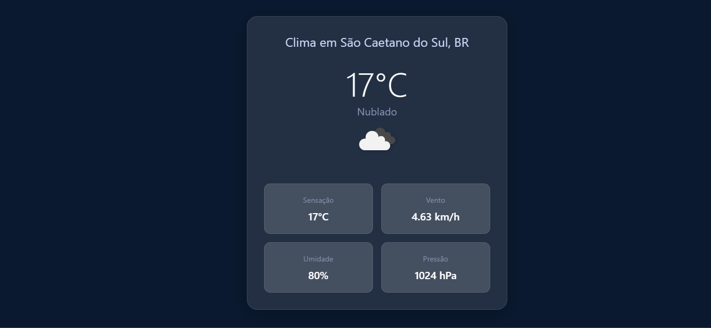

# 🌦️ Weather Dashboard - FullStack JavaScript



<p align="center">
  
  
  
  
</p>

Um dashboard de clima elegante e responsivo que mostra condições meteorológicas em tempo real.

## ✨ Funcionalidades Principais

| Feature               | Ícone | Descrição                          |
|-----------------------|-------|------------------------------------|
| Geolocalização        | 🌍    | Detecta automaticamente sua cidade |
| Busca por cidade      | 🔍    | Pesquisa manual por localização    |
| Tempo atual           | ☀️    | Temperatura e condições atuais     |
| Detalhes completos    | 📊    | Umidade, vento, pressão e mais     |
| Design responsivo     | 📱    | Funciona em qualquer dispositivo   |

## 🛠️ Stack Tecnológica

### Frontend
<p>
  
  
  
  
</p>

### Backend
<p>
  
  
  
  
</p>

## � Como Executar

```bash
# Clone o repositório
git clone https://github.com/seu-usuario/weather-dashboard.git
cd weather-dashboard

# Instale e execute o backend
cd backend && npm install && npm start

# Em outro terminal, instale e execute o frontend
cd ../frontend && npm install && npm start